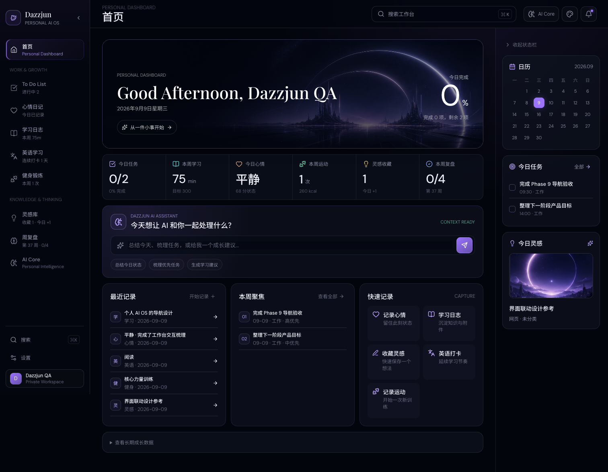
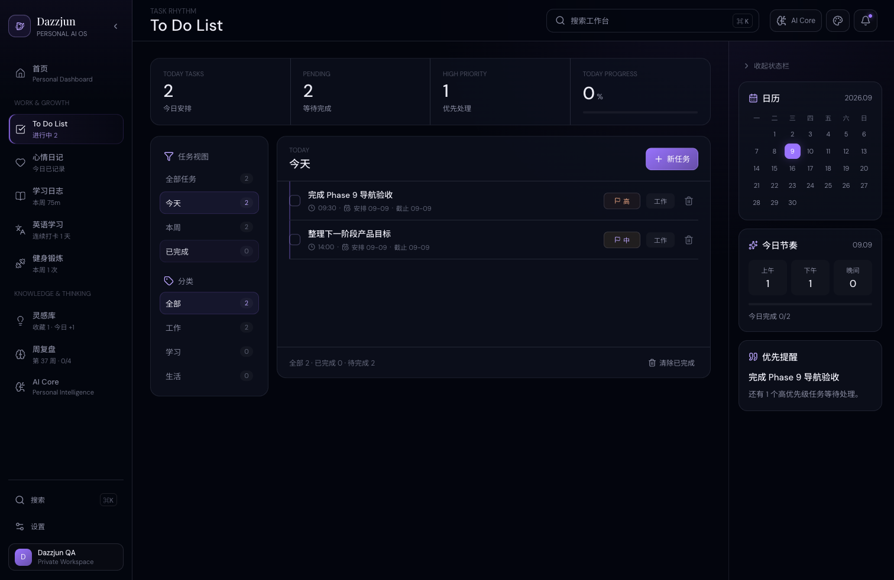
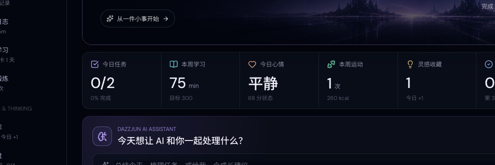
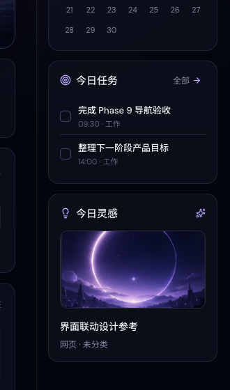
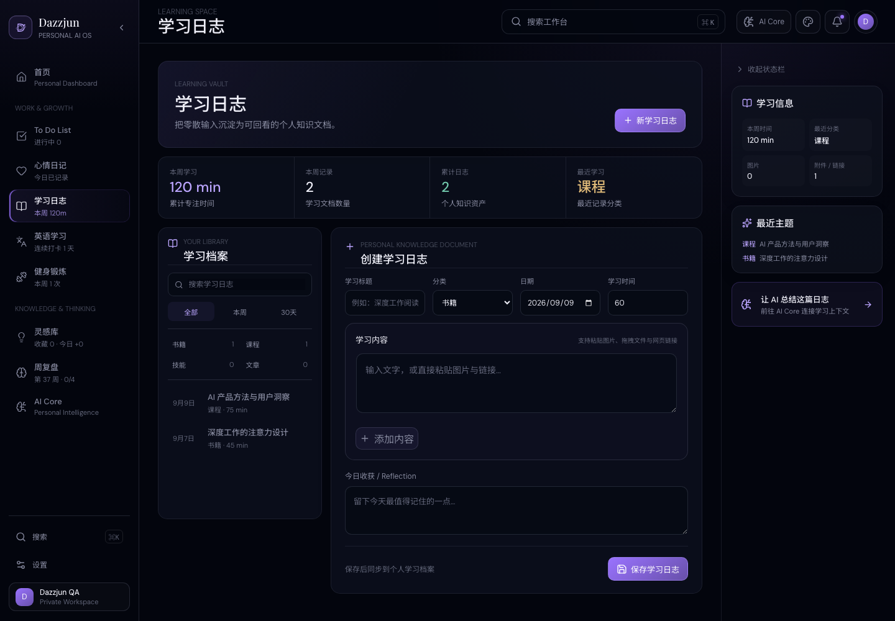

# Dazzjun

**Personal AI OS / Personal Workspace**

一个将任务、学习、情绪、健身、灵感、复盘和 AI 助手整合在一起的个人成长操作系统。

## Live Demo

[Open Dazzjun Workspace](https://dazzjun-workspace.dazzjun04.workers.dev/)

The live workspace requires an account. Each account receives an isolated private data space.

## Product Preview

The preview images use a fictional QA account and synthetic records. They do not contain production user data.

### Home



### Todo



### AI Core



### Inspiration



### Learning



## Core Features

- **Personal Dashboard** - a single view of today's tasks and current growth signals.
- **Todo System** - planned execution dates, deadlines, priorities, categories, and daily progress.
- **Mood Journal** - private mood, story, and reflection records.
- **Learning Vault** - structured learning logs with optional rich-media blocks.
- **English Practice** - check-ins, duration, vocabulary, exercises, and notes.
- **Fitness Log** - training sessions, duration, calories, and weekly rhythm.
- **Inspiration Library** - unified capture for Douyin, Xiaohongshu, and regular web links.
- **Weekly Review** - weekly goals, progress, reflection, and follow-up actions.
- **AI Core** - contextual assistance, daily insights, and user-controlled long-term memory.
- **Account Isolation** - all workspace records are resolved from the authenticated server session.
- **PWA** - installable workspace experience for desktop and mobile.

## AI Core

Dazzjun AI Core combines three bounded layers:

1. Short-term context from recent workspace records.
2. Long-term memory explicitly saved and controlled by the user.
3. The user's current task or question.

It includes a personal assistant, daily insight, AI Memory, and persistent context authorization. AI requests are authenticated, rate limited, quota controlled, and validated for bounded input/context sizes. The DeepSeek API key is never shipped to the browser.

## Architecture

```text
React + Vite PWA
       |
       v
Cloudflare Worker
   |           |
   v           v
Cloudflare D1  DeepSeek API
```

- The Worker owns authentication, authorization, validation, quotas, and provider calls.
- D1 stores account-scoped application data and persistent rate-limit buckets.
- Optional rich-media learning assets use a private Cloudflare R2 binding when enabled.
- Production secrets are configured as Worker secrets, not client environment variables.

## Security

- Session-based authentication with `HttpOnly`, `Secure`, `SameSite=Lax` cookies in production.
- Server-side user identity resolution; clients cannot override `user_id`.
- Per-user database filters for workspace, AI, learning, and inspiration data.
- Persistent D1 login/register rate limiting with hashed identifiers.
- Per-user AI minute and daily quotas.
- Bounded AI message, context, and report snapshot sizes.
- No client-side DeepSeek secret.

## Local Development

Requirements: Node.js 22 or newer and npm.

```bash
npm install
cp .env.example .env.local
npm run dev
```

The local Node backend uses `.data/dazzjun.sqlite` by default. To run the frontend against it, set:

```bash
DAZZJUN_API_PROXY_TARGET=http://127.0.0.1:8788
```

For local Worker development, copy `.dev.vars.example` to `.dev.vars` and replace placeholders locally. Do not commit `.env.local`, `.dev.vars`, database files, or real credentials.

Production secrets are configured with Wrangler, for example:

```bash
npx wrangler secret put DEEPSEEK_API_KEY
```

Before submitting changes:

```bash
npm run typecheck
npm run build
npm run test:auth
npm run test:backend
npm run test:ai
npm run test:public-readiness
```

## Project Structure

```text
src/                  React pages, components, services, and workspace state
worker/               Cloudflare Worker API, AI, learning, and capture services
backend/              Local Node/SQLite API with production-compatible contracts
database/             Base schema and incremental D1 migrations
tests/                Auth, AI, Todo, learning, inspiration, PWA, and security tests
public/               PWA icons and public visual assets
docs/screenshots/      Sanitized product preview images
```

## Roadmap

- Inspiration intelligent capture and cover provenance improvements.
- Rich-media learning vault production enablement.
- AI context and memory controls.
- Mobile PWA performance and offline experience.

---

Copyright © Dazzjun. Source code is publicly viewable for portfolio and learning purposes. No explicit reuse license is granted.
